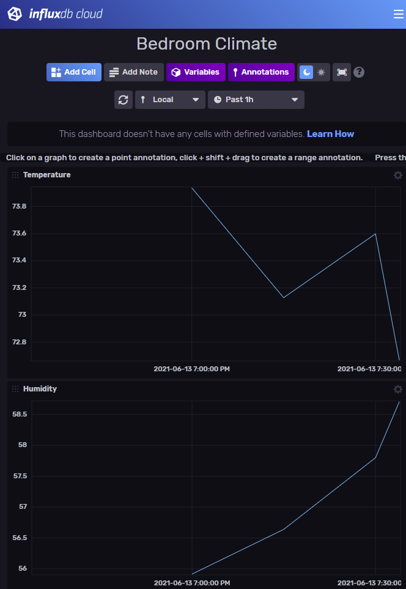

# home-guard
Logs ambient data from your home.

A connected sensor measures room temperature and humidity and store it on a cloud database server.
The measurements are available in a dashboard for monitoring and can be exported for post-processing.

## Hardware Components

- [1] Ambient sensor: [DHT-22](https://www.sparkfun.com/datasheets/Sensors/Temperature/DHT22.pdf)
- [2] Sensor MCU: [ESP32 (DOIT DEVIT V1 ESP32-WROOM-32)](https://www.amazon.com/ESP32-WROOM-32-Development-ESP-32S-Bluetooth-Arduino/dp/B084KWNMM4)

## Software

- [3] Database server: [InfluxDB Cloud 2](https://www.influxdata.com/products/influxdb-cloud/)
- [4] Database client: [InfluxDB Client for Arduino](https://github.com/tobiasschuerg/InfluxDB-Client-for-Arduino)
- [5] Temperature/Humidity sensor: [DHT sensor library by Adafruit, v1.4.2](https://github.com/adafruit/DHT-sensor-library)

## Setup

**Electrical Circuit**: Wire ambient sensor on MCU as described in [this tutorial](https://howtomechatronics.com/tutorials/arduino/dht11-dht22-sensors-temperature-and-humidity-tutorial-using-arduino/):

Note that pullup resistor for DHT-22 can be enabled by software (`pinMode(PIN_DATA, INPUT_PULLUP)`).

In prototype implementation:

**Firmware**: Setup your cloud database, install [4-5] and modify `Arduino/bedroom_sensor.ino` with your wifi credentials and database info, then upload into MCU.

At this point, the device should be sending measurements to the DB server.

## Usage

**Monitoring**: Access [dashboard](https://us-west-2-1.aws.cloud2.influxdata.com/orgs/0663d579077b3eb6/dashboards/07adfaa51af92000?lower=now%28%29%20-%201h):

